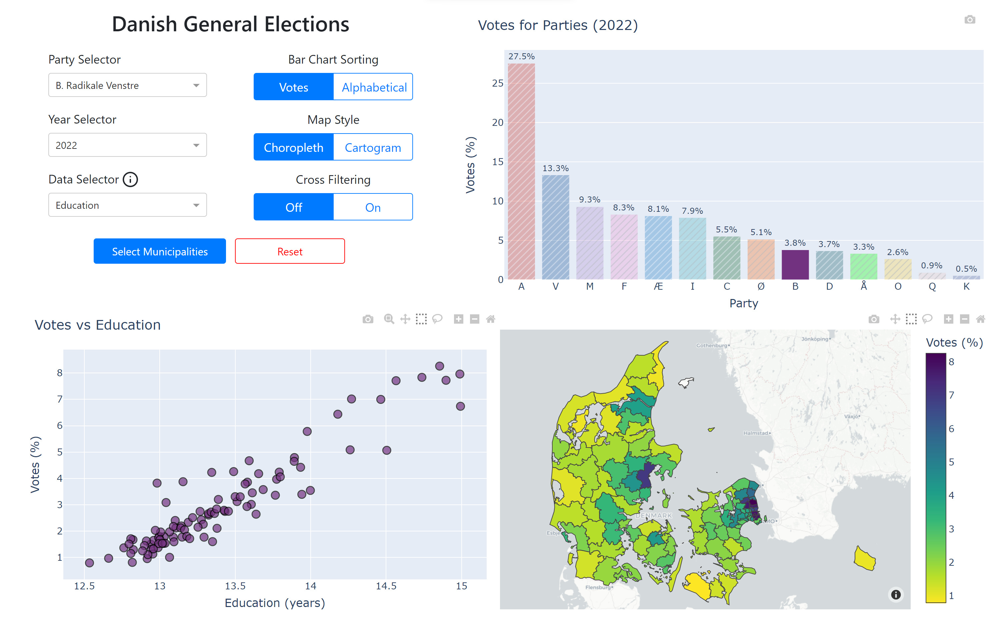

# Danish Election Visualization
This is a data visualization project to show Danish election results for the years 2007 to 2022 and correlate them with other socioeconomic data. The project uses Python, Plotly and Dash to create interactive web-based graphs and maps.

To run the project, you need to install the requirements in `requirements.txt` and run `python app.py`. This will launch a local server that you can access from your browser.

One of the features of this project is a cartogram of Danish municipalities, which can be found in `Datasets/cartogram.json`. This cartogram is a map that distorts the area of each municipality, such that the area for the municipalities in a region of Denmark is the same, without disconecting from a Danes mental map of Denmark. It was constructed this way to allow for easier viewing of the small municipalities concentrated around the capital. This is a novel contribution since there is no existing cartograms of the Danish municipalities.

A video showcasing the visualization can be found on youtube(https://youtu.be/Tyk9xlGVmwc) or as an MP4 file on Google Drive(https://drive.google.com/file/d/1q47YV59Yo2tOwUffsbvef7cDpmYh0YQm/view?usp=sharing)

